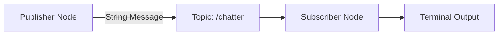
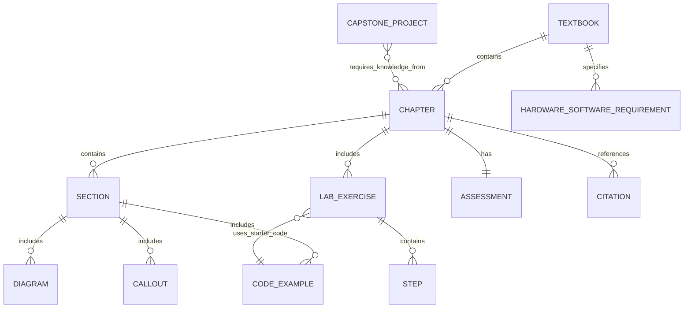
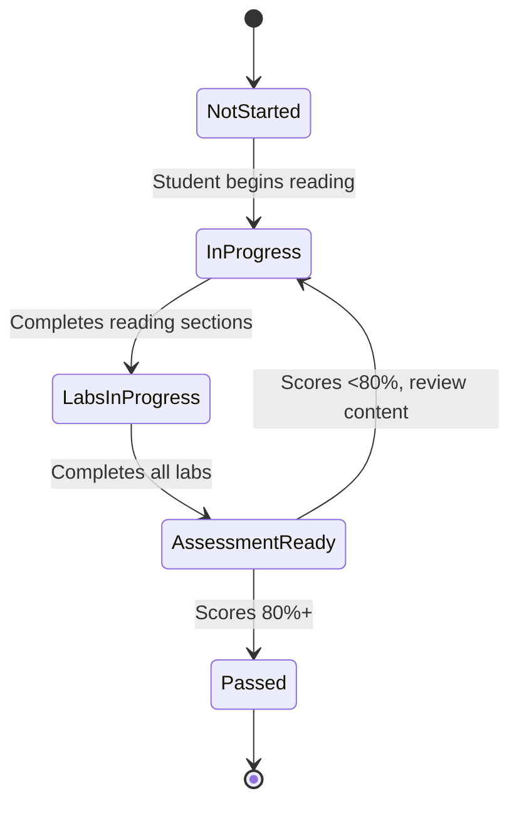
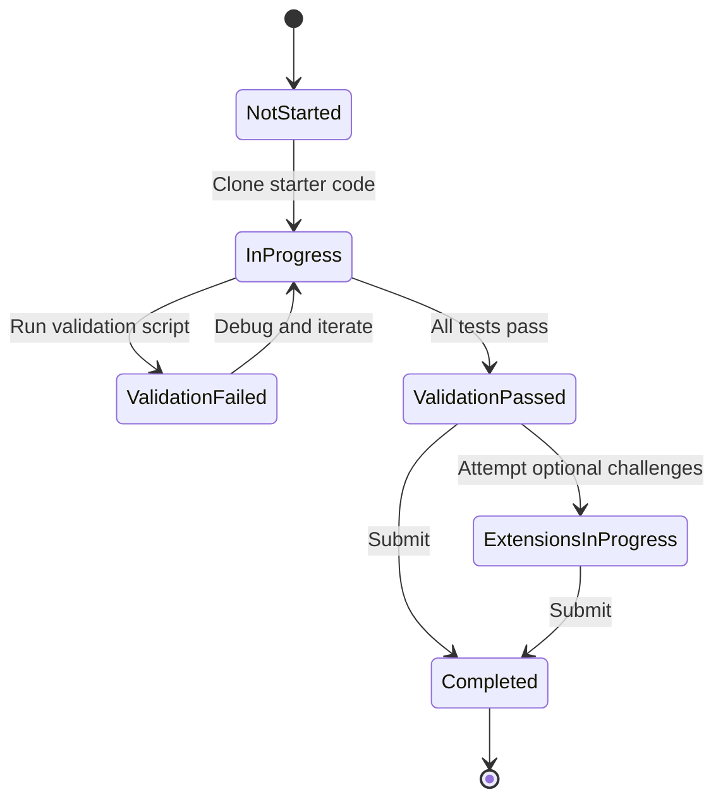
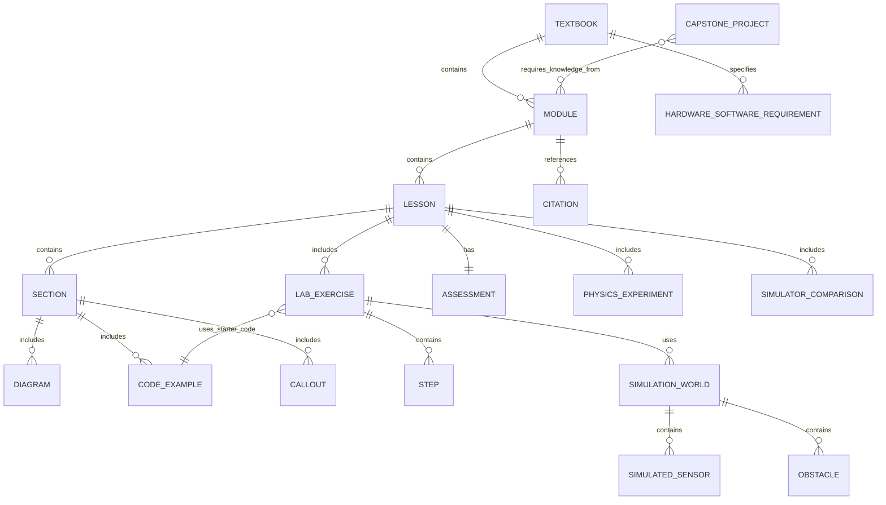

# Data Model: Physical AI & Humanoid Robotics Textbook

**Feature**: 001-physical-ai-robotics-book
**Date**: 2025-12-15
**Purpose**: Define content entities, structure, and relationships for educational material

## Overview

This textbook is a content-based system where the primary "data" consists of educational materials (chapters, labs, diagrams, code examples) organized to support student learning outcomes. Unlike traditional software data models with databases, this model describes the structure and relationships of educational content.

---

## Core Entities

### 1. Chapter

**Purpose**: A cohesive unit of instruction covering a specific topic

**Attributes**:
- `chapter_number`: Integer (1-10+) - Sequential order
- `title`: String - Descriptive chapter name
- `learning_objectives`: List<String> - 3-5 measurable learning outcomes
- `estimated_duration`: String - Expected time investment (e.g., "Week 1-2", "5-7 hours")
- `prerequisites`: List<ChapterRef> - Prior chapters that must be completed
- `content_sections`: List<Section> - Ordered list of content sections
- `lab_exercises`: List<LabExercise> - Hands-on exercises for this chapter
- `assessment`: Assessment - Quiz or knowledge check
- `citations`: List<Citation> - APA references used in this chapter

**Validation Rules**:
- `chapter_number` must be unique and sequential
- `learning_objectives` must have 3-5 items
- Each objective must be measurable (contains verbs like "explain", "create", "demonstrate")
- `prerequisites` must reference earlier chapter numbers only

**File Structure**:
```
docs/
├── chapter-01-physical-ai-intro.mdx
├── chapter-02-ros2-fundamentals.mdx
├── chapter-03-urdf-humanoid-models.mdx
...
```

---

### 2. Section

**Purpose**: A sub-division of a chapter covering a specific sub-topic

**Attributes**:
- `section_id`: String - Unique identifier (e.g., "ch02-s03-topics")
- `title`: String - Section heading
- `content`: Markdown/MDX - The actual instructional text
- `diagrams`: List<Diagram> - Visual aids for this section
- `code_examples`: List<CodeExample> - Code snippets demonstrating concepts
- `callouts`: List<Callout> - Tips, warnings, notes

**Validation Rules**:
- `section_id` must be unique across entire textbook
- `content` must be valid MDX syntax
- Sections should be 500-1200 words each (target for readability)

**Example Sections for Chapter 2 (ROS 2)**:
1. What is Physical AI? (context)
2. Role of the Robotic Nervous System
3. ROS 2 Fundamentals - Nodes
4. ROS 2 Fundamentals - Topics
5. ROS 2 Fundamentals - Services
6. Python Agents with rclpy
7. Humanoid URDF Architecture

---

### 3. LabExercise

**Purpose**: A hands-on practical task students complete to apply concepts

**Attributes**:
- `lab_id`: String - Unique identifier (e.g., "lab-02-01-pubsub")
- `title`: String - Lab name
- `objective`: String - Clear statement of what student will accomplish
- `prerequisites`: List<LabRef> - Prior labs required
- `estimated_time`: Integer - Minutes (60-180 per lab)
- `starter_code_url`: String - GitHub link to starter code
- `steps`: List<Step> - Ordered instructions
- `validation_script`: String - Path to automated test script
- `extensions`: List<String> - Optional advanced challenges
- `expected_outputs`: List<String> - What success looks like

**Validation Rules**:
- `estimated_time` must be between 60-180 minutes (SC-009 requirement)
- `steps` must have 5-10 items for proper scaffolding
- `validation_script` must be executable and test success criteria

**File Structure**:
```
labs/
├── lab-02-01-hello-ros2/
│   ├── README.md           # Lab instructions
│   ├── starter/            # Starter code with TODOs
│   ├── solution/           # Reference solution
│   └── validate.py         # Automated test script
├── lab-02-02-pubsub/
...
```

---

### 4. CodeExample

**Purpose**: Illustrative code snippet embedded in chapter content

**Attributes**:
- `example_id`: String - Unique identifier
- `language`: String - Programming language (python, cpp, xml, bash)
- `code`: String - The actual code
- `caption`: String - Brief explanation of what code demonstrates
- `highlights`: List<LineRange> - Lines to emphasize in rendering
- `runnable`: Boolean - Whether example can be executed standalone

**Validation Rules**:
- `code` must be syntactically valid for specified `language`
- `code` length should be 10-30 lines for in-textbook examples (longer → GitHub)
- All code examples must be tested (SC-012: 100% must run successfully)

**Example**:
```python
# example_id: "ros2-minimal-publisher"
# language: python
# caption: "Minimal ROS 2 publisher node using rclpy"

import rclpy
from rclpy.node import Node
from std_msgs.msg import String

class MinimalPublisher(Node):
    def __init__(self):
        super().__init__('minimal_publisher')
        self.publisher_ = self.create_publisher(String, 'topic', 10)
        self.timer = self.create_timer(0.5, self.timer_callback)

    def timer_callback(self):
        msg = String()
        msg.data = 'Hello ROS 2'
        self.publisher_.publish(msg)
```

---

### 5. Diagram

**Purpose**: Visual representation to clarify complex systems

**Attributes**:
- `diagram_id`: String - Unique identifier
- `type`: Enum - [mermaid_flowchart, mermaid_sequence, mermaid_graph, svg, screenshot]
- `source`: String - Mermaid code, SVG path, or image path
- `caption`: String - Figure caption
- `alt_text`: String - Accessibility description

**Validation Rules**:
- Mermaid diagrams must render without errors
- SVG files must be valid XML
- Screenshots must be high-resolution (min 1920x1080 for readability)

**Example (Mermaid)**:


---

### 6. Citation

**Purpose**: APA-formatted reference to sources

**Attributes**:
- `citation_id`: String - Unique identifier (e.g., "brooks1999")
- `type`: Enum - [journal_article, conference_paper, technical_doc, book, website]
- `authors`: List<String> - Author names (Last, First)
- `year`: Integer - Publication year
- `title`: String - Article/document title
- `source`: String - Journal name, conference, URL, etc.
- `doi_or_url`: String - Digital object identifier or web link

**Validation Rules**:
- Must follow APA 7th edition format
- `year` must be within last 12 years for peer-reviewed (SC-008) or authoritative source
- Minimum 15 citations across entire textbook

**Example**:
```
Brooks, R. A. (1999). Cambrian intelligence: The early history of the new AI. MIT Press.

Quigley, M., Conley, K., Gerkey, B., Faust, J., Foote, T., Leibs, J., ... & Ng, A. Y. (2009, May). ROS: an open-source Robot Operating System. In ICRA workshop on open source software (Vol. 3, No. 3.2, p. 5).
```

---

### 7. Assessment

**Purpose**: Knowledge check or quiz to validate learning

**Attributes**:
- `assessment_id`: String - Unique identifier
- `type`: Enum - [quiz, knowledge_check, practical_demo]
- `questions`: List<Question> - Assessment items
- `passing_threshold`: Integer - Percentage required to pass (typically 80%)
- `time_limit`: Integer - Minutes (or null for untimed)

**Validation Rules**:
- Quiz must have 5-10 questions per chapter
- Questions must map to specific learning objectives
- Answers must be unambiguous

**Question Types**:
- Multiple choice
- True/False
- Short answer
- Code completion

---

### 8. HardwareSoftwareRequirement

**Purpose**: Specification of tools needed for course activities

**Attributes**:
- `requirement_id`: String - Unique identifier
- `tier`: Enum - [minimum, recommended, cloud_alternative]
- `category`: Enum - [hardware, operating_system, software, library]
- `name`: String - Item name
- `version`: String - Required version or version range
- `description`: String - Why needed and when used
- `installation_url`: String - Link to setup instructions

**Validation Rules**:
- Must have at least one option for each tier
- All software must be available free or with educational license

**Example**:
```yaml
requirement_id: ros2-humble
tier: minimum
category: software
name: ROS 2 Humble Hawksbill
version: ">=2023.1.0"
description: "Robot Operating System middleware for Weeks 3-10"
installation_url: "https://docs.ros.org/en/humble/Installation.html"
```

---

### 9. CapstoneProject

**Purpose**: Final integrative project specification

**Attributes**:
- `project_id`: String - Unique identifier
- `title`: String - Project name
- `description`: String - 2-3 paragraph overview
- `required_modules`: List<ChapterRef> - All chapters needed as prerequisites
- `deliverables`: List<String> - What students submit (code, video, report)
- `evaluation_rubric`: List<RubricCriteria> - Grading criteria
- `timeline`: String - Suggested project schedule
- `example_projects`: List<ExampleProject> - Past student work or templates

**Validation Rules**:
- Must integrate concepts from at least 5 chapters
- `evaluation_rubric` must be objective and measurable
- Aligns with SC-003: 80% completion target

---

## Entity Relationships



---

## Content Organization Structure

```
physical-ai-robotics-textbook/
├── docs/                           # Docusaurus content
│   ├── intro.mdx                   # Course overview
│   ├── chapter-01-physical-ai-intro.mdx
│   ├── chapter-02-ros2-fundamentals.mdx
│   ├── chapter-03-urdf-humanoid-models.mdx
│   ├── chapter-04-simulation-gazebo.mdx
│   ├── chapter-05-perception-sensors.mdx
│   ├── chapter-06-motion-planning.mdx
│   ├── chapter-07-isaac-sim-intro.mdx
│   ├── chapter-08-vla-architectures.mdx
│   ├── chapter-09-capstone-overview.mdx
│   ├── chapter-10-capstone-implementation.mdx
│   └── appendix/
│       ├── setup-guide.mdx
│       ├── troubleshooting.mdx
│       └── migration-gazebo-garden.mdx
├── labs/                           # Lab exercises
│   ├── lab-01-01-setup-ros2/
│   ├── lab-02-01-hello-ros2/
│   ├── lab-02-02-pubsub/
│   ├── lab-03-01-urdf-basics/
│   ...
├── static/                         # Static assets
│   ├── diagrams/
│   │   ├── ros2-graph.svg
│   │   ├── humanoid-anatomy.svg
│   │   └── vla-pipeline.svg
│   └── img/
│       ├── gazebo-screenshot-01.png
│       └── isaac-sim-example.png
├── src/                            # Docusaurus config
│   └── components/
│       ├── InteractiveDiagram.jsx
│       └── CodePlayground.jsx
├── docusaurus.config.js
├── sidebars.js
└── package.json
```

---

## State Transitions

### Chapter Progression State



### Lab Exercise State



---

## Validation Rules Summary

1. **Content Quality**:
   - All code examples must be tested and run successfully (SC-012)
   - Total word count across all chapters: 5,000-7,000 words (FR-014)
   - Mermaid/SVG diagrams must render correctly (FR-009)

2. **Educational Structure**:
   - 10+ chapters aligned with 10-12 week schedule (FR-007)
   - Each chapter includes at least 1 lab (FR-008, SC-009)
   - Labs are 1-3 hours each (SC-009)

3. **Citations**:
   - Minimum 15 APA-style citations (FR-011, SC-008)
   - Majority from last 12 years (SC-008)
   - Mix of peer-reviewed and technical documentation

4. **Accessibility**:
   - All diagrams have alt text
   - Code examples have captions
   - Prerequisite chains are clear

---

---

## Module 2: The Digital Twin - Additional Entities

### 10. SimulationWorld

**Purpose**: Describes a Gazebo simulation environment for lab exercises

**Attributes**:
- `world_id`: String - Unique identifier (e.g., "navigation-testbed-world")
- `name`: String - Descriptive world name
- `sdf_file`: String - Path to SDF world file
- `terrain_type`: Enum - [flat, heightmap, custom_mesh]
- `obstacles`: List<Obstacle> - Static obstacles in the world
- `lighting`: LightingConfig - Lighting settings
- `physics_engine`: Enum - [ode, bullet, dart, tpe]
- `physics_params`: PhysicsParams - Gravity, time step, etc.

**Validation Rules**:
- `sdf_file` must be valid SDF format
- `physics_params.gravity` must be -9.8 m/s² unless intentionally modified
- World must load in Gazebo within 30 seconds

**Example**:
```yaml
world_id: "module2-lab2-custom-world"
name: "Obstacle Course World"
sdf_file: "worlds/obstacle_course.sdf"
terrain_type: flat
obstacles:
  - type: box
    size: [1.0, 1.0, 1.0]
    position: [2.0, 0.0, 0.5]
  - type: cylinder
    radius: 0.5
    height: 1.0
    position: [4.0, 2.0, 0.5]
physics_engine: ode
physics_params:
  gravity: -9.8
  step_size: 0.001
  real_time_factor: 1.0
```

---

### 11. SimulatedSensor

**Purpose**: Configuration for a sensor in Gazebo simulation

**Attributes**:
- `sensor_id`: String - Unique identifier
- `sensor_type`: Enum - [camera, depth_camera, lidar, imu, contact, force_torque]
- `topic_name`: String - ROS 2 topic for sensor data
- `message_type`: String - ROS 2 message type (e.g., sensor_msgs/Image)
- `update_rate`: Float - Hz
- `noise_model`: NoiseConfig - Optional noise parameters
- `plugin_params`: Map - Sensor-specific configuration

**Validation Rules**:
- `topic_name` must follow ROS 2 naming conventions
- `update_rate` must be between 1-100 Hz
- `message_type` must match standard ROS 2 sensor message types

**Sensor Type Configurations**:

| Sensor Type | Message Type | Key Parameters |
|-------------|--------------|----------------|
| Camera | sensor_msgs/Image | resolution, fov, format |
| Depth Camera | sensor_msgs/Image, sensor_msgs/PointCloud2 | resolution, range |
| LiDAR | sensor_msgs/LaserScan | samples, range, angle |
| IMU | sensor_msgs/Imu | noise_stddev, rate |

**Example**:
```yaml
sensor_id: "front_camera"
sensor_type: camera
topic_name: "/robot/camera/image_raw"
message_type: "sensor_msgs/Image"
update_rate: 30.0
plugin_params:
  width: 640
  height: 480
  format: RGB8
  horizontal_fov: 1.047  # 60 degrees
```

---

### 12. PhysicsExperiment

**Purpose**: Defines a hands-on physics experiment for Lesson 1

**Attributes**:
- `experiment_id`: String - Unique identifier
- `title`: String - Experiment name
- `objective`: String - What student will observe/learn
- `parameters_to_modify`: List<PhysicsParam> - What to change
- `expected_observations`: List<String> - What should happen
- `reflection_questions`: List<String> - Questions to answer

**Example**:
```yaml
experiment_id: "gravity-experiment"
title: "Gravity Effects on Robot Free Fall"
objective: "Observe how gravity parameter affects robot drop behavior"
parameters_to_modify:
  - name: gravity
    initial_value: -9.8
    test_values: [-9.8, -4.9, -19.6, 0]
expected_observations:
  - "Robot falls faster with increased gravity magnitude"
  - "Robot floats at 0 gravity"
  - "Joint stress increases with higher gravity"
reflection_questions:
  - "How would Moon gravity (1.62 m/s²) affect humanoid walking?"
  - "Why does increased gravity create more joint stress?"
```

---

### 13. SimulatorComparison

**Purpose**: Structured comparison data for Gazebo vs Unity lesson

**Attributes**:
- `comparison_id`: String - Unique identifier
- `dimension`: String - Comparison category
- `gazebo_value`: String - Gazebo characteristic
- `unity_value`: String - Unity characteristic
- `recommendation`: String - When to prefer each

**Comparison Dimensions**:

| Dimension | Gazebo | Unity | Recommendation |
|-----------|--------|-------|----------------|
| **License** | Open Source (Apache 2.0) | Proprietary (free tier available) | Gazebo for academic/open projects |
| **ROS Integration** | Native ros_gz bridge | Requires ROS-Unity bridge setup | Gazebo for ROS-centric workflows |
| **Physics Accuracy** | High-fidelity physics engines | Game-optimized physics | Gazebo for contact-rich manipulation |
| **Visual Quality** | Functional, moderate fidelity | Photorealistic rendering | Unity for VR/AR, synthetic data |
| **Learning Curve** | ROS knowledge required | Unity/C# knowledge required | Gazebo for ROS 2 students |
| **Performance** | CPU-based, lighter weight | GPU-accelerated, heavier | Unity for large visual scenes |

---

## Updated Entity Relationships (with Module 2)



---

## Module 2 Content Organization

```
physical-ai-robotics-textbook/
├── docs/
│   ├── module-01-ros2/           # Module 1 (existing)
│   │   ├── lesson-01-physical-ai.mdx
│   │   └── ...
│   ├── module-02-simulation/     # Module 2 (new)
│   │   ├── _category_.json
│   │   ├── lesson-01-digital-twin.mdx
│   │   ├── lesson-02-gazebo-workflows.mdx
│   │   └── lesson-03-sensors-unity.mdx
│   └── appendix/
│       └── references.mdx        # Updated with Module 2 citations
├── labs/
│   ├── module-01/                # Module 1 labs (existing)
│   └── module-02/                # Module 2 labs (new)
│       ├── _category_.json
│       ├── lab-01-physics-experiments/
│       │   ├── README.md
│       │   ├── starter/
│       │   │   └── physics_observer.py
│       │   ├── solution/
│       │   │   └── physics_observer.py
│       │   └── validate.py
│       ├── lab-02-gazebo-worlds/
│       │   ├── README.md
│       │   ├── starter/
│       │   │   └── worlds/custom_world.sdf
│       │   ├── solution/
│       │   │   └── worlds/custom_world.sdf
│       │   └── validate.py
│       └── lab-03-sensor-visualization/
│           ├── README.md
│           ├── starter/
│           │   ├── sensor_config.yaml
│           │   └── sensor_analyzer.py
│           ├── solution/
│           │   ├── sensor_config.yaml
│           │   └── sensor_analyzer.py
│           └── validate.py
└── static/
    └── diagrams/
        ├── simulation-pipeline.svg
        ├── sensor-raycasting.svg
        └── gazebo-unity-comparison.svg
```

---

## Next Steps

This data model will inform:
1. **Docusaurus configuration** (sidebars, plugins)
2. **Content templates** (chapter template, lab template)
3. **Validation scripts** (word count, citation checker, code tester)
4. **GitHub repository structure** (docs/, labs/, static/)
5. **Module 2 simulation entities** (worlds, sensors, experiments)
